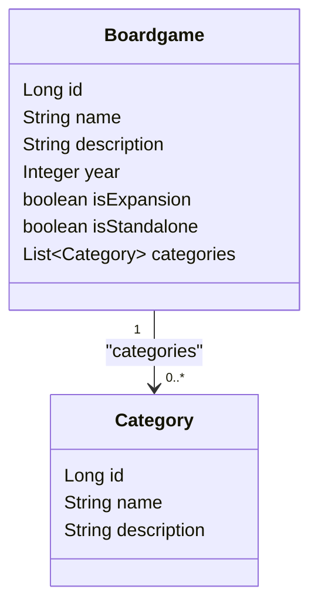

# BG Inventory

## About
A simple project used to store a boardgame collection.

## Class Diagram

```mermaid
classDiagram
    class Boardgame {
        Long id
        String name
        String description
        Integer year
        boolean isExpansion
        boolean isStandalone
        List~Category~ categories
    }

    class Category {
        Long id
        String name
        String description
    }

    Boardgame "1" --> "0..*" Category : "categories"

```
